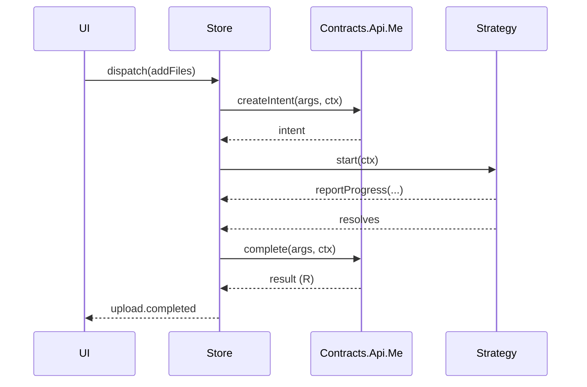

The `Contracts` namespace holds every integration point between the engine and the outside
world: what your backend implements, what the transport does, and what a strategy looks like.
Each concern is a sub-namespace so the names stay short and grouped.

## Contracts.Api.Me

Your backend adapter implements `Contracts.Api.Me<M, P, R>`. Two methods are required; the rest
are opt-in per feature.

```ts
import type { Contracts } from '@gentleduck/upload/core'

const api: Contracts.Api.Me<Intents, Purpose, Result> = {
  createIntent(args, ctx) { /* … */ },
  complete(args, ctx) { /* … */ },
  // findByChecksum?, multipart?, tus?
}
```

Every method takes call-specific `args` plus a **context** object `ctx`.

### createIntent (required)

Asks your backend how a file should be uploaded. Returns a value from the intent map `M` — the
`strategy` field on the returned object selects which registered strategy runs.

```ts
async createIntent({ purpose, contentType, size, filename, checksum, attempt }, ctx) {
  // ctx.file and ctx.signal are guaranteed present here.
  const res = await fetch('/api/uploads/intent', {
    method: 'POST',
    body: JSON.stringify({ purpose, contentType, size, filename, checksum }),
    signal: ctx.signal,
  })
  return res.json() // e.g. a PostStrategy.Intent or MultipartStrategy.Intent
}
```

### complete (required)

Finalizes the upload after bytes land and returns your typed `R`.

```ts
async complete({ fileId, filename, contentType, size, checksum, attempt }, ctx) {
  const res = await fetch(`/api/uploads/${fileId}/complete`, {
    method: 'POST',
    body: JSON.stringify({ filename, contentType, size }),
    signal: ctx.signal,
  })
  return res.json() // Result
}
```

Use the sanitized `filename` from `args`, never the raw browser `File.name`.

### Optional methods

| Method | Enables |
| --- | --- |
| `findByChecksum(args, ctx)` | Deduplication — return `R` to skip the upload, or `null` |
| `getSignedPreviewUrl(args, ctx)` | Fetch a signed URL for a completed file |
| `multipart.signPart` / `multipart.completeMultipart` | Required by the multipart strategy |
| `multipart.listParts` / `multipart.abort` | Optional multipart housekeeping |
| `tus.create` / `tus.getOffset` | Contract hooks for a TUS strategy |

> The `tus` methods exist in the contract, but the package does **not** ship a built-in TUS
> strategy yet — only `PostStrategy` and `multipartStrategy`. To use TUS today you'd write a
> custom strategy (see [Strategy Registry](/duck-upload/strategies/registry)) that consumes
> these methods.

### The call context

Every method receives a `Contracts.Api.Context<P, M>`. Handy fields:

| Field | Notes |
| --- | --- |
| `localId` | Client id for this item |
| `purpose` | The upload's purpose |
| `fingerprint` | `{ name, size, type, lastModified, checksum? }` — always present |
| `attempt` | 1-based, increments on retry |
| `meta` | Caller metadata from `addFiles` (never persisted) |
| `signal` | Abort signal (present in `createIntent`/`complete`) |
| `file` | The `File` (present in most phases) |
| `intent` | Present after `createIntent` succeeds |
| `steps` | Phase history; errors have `cause` stripped |

Refined contexts tighten which fields are guaranteed: `CreateIntentContext` guarantees `file`
and `signal`; `CompleteContext` also guarantees `intent`.

## Transport.Options

The transport abstracts raw HTTP so strategies stay testable. Two implementations ship, and the
store installs `createXHRTransport()` by default:

* **`createXHRTransport()`** — browser transport built on `XMLHttpRequest` for real upload
  progress events. The default.
* **`createFetchTransport()`** — `fetch`-based transport for Node, SSR, edge, and workers (any
  runtime without `XMLHttpRequest`). Pass it via the `transport` store option.

```ts
type Options = {
  put(args):      Promise<{ etag?: string; headers?: Record<string, string> }>
  postForm(args): Promise<{ etag?: string; headers?: Record<string, string> }>
  patch(args):    Promise<{ headers?: Record<string, string> }>
  get?(args):     Promise<{ blob: Blob; status: number; headers?: Record<string, string> }>
  head?(args):    Promise<{ status: number; headers: Record<string, string> }>
}
```

Each upload method takes a `url`, a body/fields, an `AbortSignal`, and an optional `onProgress`
callback. `patch` is used by the [tus strategy](/duck-upload/strategies/tus); `head` reads its
resume offset; `get` is an optional streaming download. `get` and `head` are optional — check
for presence before calling. Provide your own `Transport.Options` for a custom runtime or mocks.

```ts
import { createFetchTransport } from '@gentleduck/upload/core'

createUploadStore({ transport: createFetchTransport(), /* … */ })
```

**Note:** `fetch` has no portable upload-progress API, so `createFetchTransport()` reports a
single terminal `onProgress(total, total)` on `put`/`postForm`/`patch`. Download progress via
`get()` **is** streamed and incremental. Use `createXHRTransport()` in the browser when you need
byte-level upload progress.

## Contracts.Strategy.Me

A strategy turns an intent into network calls. It is a small object:

```ts
type Me<M, C, P, R, K> = {
  id: K              // must equal the intent's `strategy` field
  resumable: boolean // can it pick up after a pause?
  start(ctx: Ctx<M, C, P, R, K>): Promise<void>
}
```

`start` receives a rich `Contracts.Strategy.Ctx` with `file`, `intent`, `signal`, the injected
`transport`, your `api`, `reportProgress`, and cursor helpers `readCursor`/`persistCursor`. See
[Strategies](/duck-upload/strategies) for full details and a custom-strategy example.

## Contracts.Strategy.Registry

The registry maps strategy ids to implementations and keeps the engine decoupled:

```ts
type Registry<M, C, P, R> = {
  get<K>(id: K): Me<M, C, P, R, K> | undefined
  has(id: string): id is keyof M & string
  set<K>(strategy: Me<M, C, P, R, K>): void
}
```

Build one with `createStrategyRegistry()` and populate it via `.set()`.

## Supporting shapes

* `Contracts.Result.Base` — `{ fileId: string; key: string }`; extend it as `R`.
* `Contracts.Intent.Base<K>` — `{ strategy: K; fileId: string }`; the base for every intent.
* `Contracts.FingerprintFile` — the file identity signature (optionally with a `checksum`).
* `Contracts.ValidationRules` — the per-purpose rules described in
  [Store Options](/duck-upload/core/client).
* `Contracts.Validation.Rejection` — the discriminated reason a file was rejected.
* `Contracts.Errors.Error` — the plain error shape carried through events (see
  [Errors](/duck-upload/core/errors)).

## Upload lifecycle sequence

