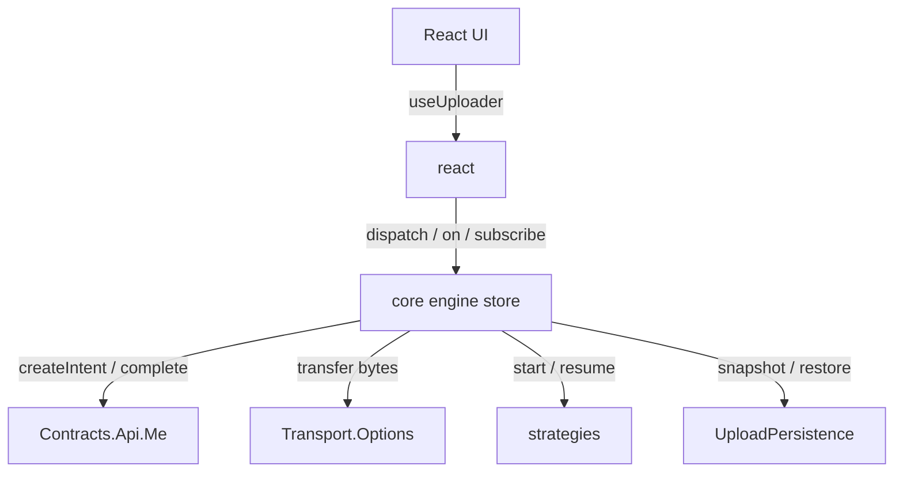

## What is Duck Upload?

Duck Upload (`@gentleduck/upload`) is a framework-agnostic engine for moving files from a
browser into object storage. It owns the hard parts of uploading — a lifecycle state machine,
concurrency scheduling, retries with backoff, pause/resume, deduplication, and crash-safe
persistence — and leaves the transport protocol to pluggable **strategies**.

The mental model is close to a data-fetching library like TanStack Query: a small typed core
holds all the state and does the scheduling, adapters plug into the edges, and a thin React
binding reads the core. Nothing about React leaks into the engine, so the same store runs in
Node, a worker, Vue, or plain JavaScript.

## The four type parameters

Every public API is generic over the same four parameters. Learn them once and the rest of the
library reads naturally:

| Param | Name | What it describes |
| --- | --- | --- |
| `M` | Intent map | Every strategy your backend can pick, keyed by strategy id, mapped to the intent shape it returns |
| `C` | Cursor map | Per-strategy resume state, keyed by the same ids (optional per key) |
| `P` | Purpose | A string union categorizing uploads (`'avatar' \| 'attachment'`) |
| `R` | Result | The typed payload your backend returns from `complete()` |

`P` drives per-purpose validation, `autoStart`, and the `purpose` filter on batch commands.
`R` flows end-to-end, so `item.result` is fully typed with no casts.

## Package layout

```text
@gentleduck/upload            # everything (core + react + strategies)
@gentleduck/upload/core       # engine, contracts, persistence, errors, transport
@gentleduck/upload/react      # <UploadProvider> + hooks
@gentleduck/upload/strategies # PostStrategy, multipartStrategy, registry helper
```

## Architecture at a glance



## Quick start

The whole setup is: describe the types, implement the backend contract, register strategies,
create the store.

```ts
import type { Contracts } from '@gentleduck/upload/core'
import { createUploadStore } from '@gentleduck/upload/core'
import {
  PostStrategy,
  multipartStrategy,
  createStrategyRegistry,
  type MultipartStrategy,
} from '@gentleduck/upload/strategies'

// 1. Describe the pipeline.
type Intents = { post: PostStrategy.Intent; multipart: MultipartStrategy.Intent }
type Cursors = { post?: PostStrategy.Cursor; multipart?: MultipartStrategy.Cursor }
type Purpose = 'avatar' | 'attachment'
type Result = Contracts.Result.Base & { url: string }

// 2. Implement your backend contract.
const api: Contracts.Api.Me<Intents, Purpose, Result> = {
  async createIntent({ purpose, contentType, size, filename }, ctx) {
    const res = await fetch('/api/uploads/intent', {
      method: 'POST',
      headers: { 'content-type': 'application/json' },
      body: JSON.stringify({ purpose, contentType, size, filename }),
      signal: ctx.signal,
    })
    if (!res.ok) throw new Error(`intent failed: ${res.status}`)
    return res.json()
  },
  async complete({ fileId, filename, contentType, size }, ctx) {
    const res = await fetch(`/api/uploads/${fileId}/complete`, {
      method: 'POST',
      headers: { 'content-type': 'application/json' },
      body: JSON.stringify({ filename, contentType, size }),
      signal: ctx.signal,
    })
    if (!res.ok) throw new Error(`complete failed: ${res.status}`)
    return res.json()
  },
}

// 3. Register strategies (the registry starts empty; add with .set()).
const strategies = createStrategyRegistry<Intents, Cursors, Purpose, Result>()
strategies.set(PostStrategy())
strategies.set(multipartStrategy({ maxPartConcurrency: 4 }))

// 4. Build the store.
export const store = createUploadStore<Intents, Cursors, Purpose, Result>({
  api,
  strategies,
  config: { autoStart: ['avatar'] },
})
```

### Drive it

Everything happens through `dispatch`. Read state with `getSnapshot`, listen with `on`.

```ts
const file = new File(['…'], 'photo.jpg', { type: 'image/jpeg' })
store.dispatch({ type: 'addFiles', files: [file], purpose: 'attachment' })

const unsub = store.on('upload.completed', ({ localId, result }) => {
  console.log('done', localId, result.url)
})

store.dispatch({ type: 'startAll' })
```

### Await results

`waitFor` resolves once the given items reach a terminal phase:

```ts
const ids = Array.from(store.getSnapshot().items.keys())
for (const outcome of await store.waitFor(ids)) {
  if (outcome.status === 'completed') {
    console.log(outcome.result.fileId, outcome.result.key)
  }
}
```

## Design goals

* **One source of truth.** All mutations run through a reducer; snapshots are immutable so
  `useSyncExternalStore` never tears.
* **Strategies stay at the edge.** The engine picks a strategy by the `strategy` field on the
  intent and never imports strategy code.
* **Typed from backend to UI.** `R` reaches `item.result` and the `upload.completed` event
  without a cast.
* **Types live next to their module.** No mega types folder; each concern owns its shapes.

## Where to go next

* [Installation](/duck-upload/installation) — add the package and wire the pieces.
* [Core Overview](/duck-upload/core) → [Engine](/duck-upload/core/engine) — the state machine.
* [React Overview](/duck-upload/react) — the provider and hooks.
* [Course](/duck-upload/course) — build a full app, chapter by chapter.