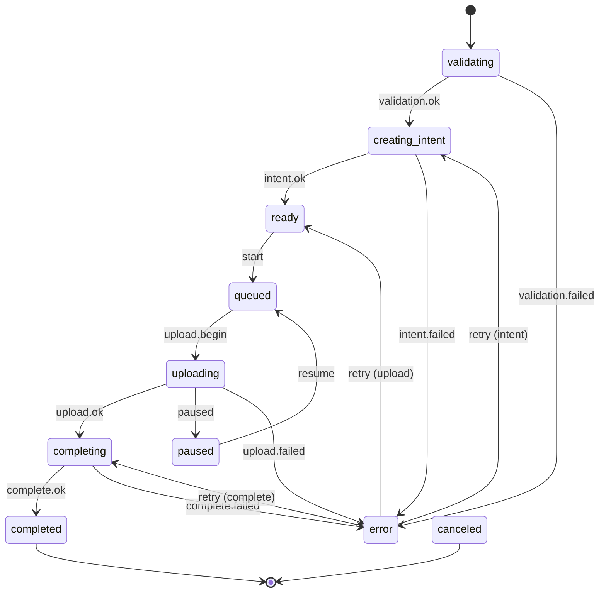

The engine runs the upload state machine, scheduler, and side effects. State
changes go through the reducer; public events emit from one transition layer.

## State Machine

## Scheduling

The scheduler keeps making progress:

- **Intent creation** for items in `creating_intent`.
- **Upload slots** for `queued` items, up to the configured concurrency limit.
- **Finalization** for items in `completing`.

## Event Emission

Public events emit from `store.runtime.ts` after transitions, not inside handlers.
That prevents duplicates and keeps semantics consistent.

| Internal Event | Public Event |
| --- | --- |
| `validation.ok` | `validation.ok` + `intent.creating` |
| `upload.begin` | `upload.started` |
| `upload.ok` | `upload.completing` |
| `complete.ok` | `upload.completed` |

`file.rejected` emits during `addFiles` because rejected files never enter state.

## Retry Model

`retryDecision` centralizes retry policy. Handlers ask for a decision; they don't
hardcode retry logic. The default allows up to 3 attempts with exponential backoff.