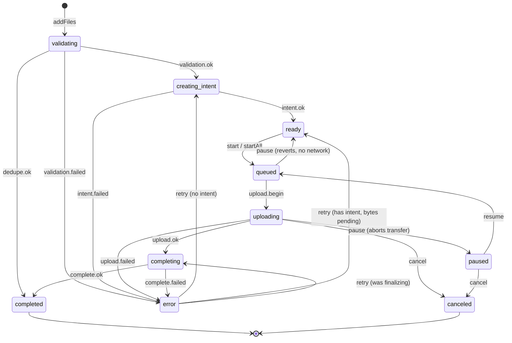

The engine is the store's brain: a strict phase state machine, a scheduler that keeps work
flowing within concurrency limits, a single event-emission layer, and a centralized retry
policy. All of it lives under the `Engine` namespace and runs through one reducer.

## Phases

Every item carries a `phase` discriminant. `Engine.Phases` is the const map; `Engine.Phase` is
its union.

| Phase | Meaning |
| --- | --- |
| `validating` | Running validation rules |
| `creating_intent` | Calling `api.createIntent()` |
| `ready` | Intent received; waiting for `start`/`autoStart` |
| `queued` | Wants to upload; waiting for a concurrency slot |
| `uploading` | Transferring bytes |
| `paused` | Paused; resumable cursor preserved |
| `completing` | Calling `api.complete()` |
| `completed` | Done and finalized (`completedBy: 'upload' \| 'dedupe'`) |
| `error` | Terminal-for-now failure (may be retryable) |
| `canceled` | Canceled by the user |

`Engine.Item` is a discriminated union over `phase`, so checking `item.phase === 'uploading'`
narrows the type and unlocks `item.progress`, `item.intent`, and friends.

## State machine



## Scheduling

After every state change the scheduler looks for work it can start without exceeding limits:

- **Intent creation** for `creating_intent` items.
- **Upload slots** for `queued` items, up to `maxConcurrentUploads`.
- **Finalization** for `completing` items.

When more items are ready than there are slots, the extras sit in `queued` until a slot frees.

## The event layer

State-derived public events emit from one place after transitions — not inside individual
handlers. This guarantees no duplicate events and consistent ordering. Internal reducer events
map to the public `Engine.EventMap` names you subscribe to with `store.on(...)`:

| Internal event | Public event(s) |
| --- | --- |
| `validation.ok` | `validation.ok`, then `intent.creating` |
| `intent.ok` | `intent.created` |
| `upload.begin` | `upload.started` |
| `upload.progress` | `upload.progress` |
| `cursor.updated` | `upload.cursor` |
| `upload.ok` | `upload.completing` |
| `dedupe.ok` / `complete.ok` | `upload.completed` |

`file.rejected` emits during `addFiles`, because rejected files never enter the state machine.

### Public events

The events actually emitted are: `file.added`, `file.rejected`, `validation.ok`/`validation.failed`,
`intent.creating`/`intent.created`/`intent.failed`, `upload.queued`, `upload.resumed`,
`upload.started`, `upload.progress`, `upload.cursor`, `upload.paused`, `upload.canceled`,
`upload.completing`, `upload.completed`, and `upload.error`.

> `Engine.EventMap` also declares `upload.removed`, `rebind.ok`, and `rebind.failed`, but the
> engine does not currently emit them — don't rely on subscribing to those. After a `rebind`,
> read the snapshot to see whether `item.file` was attached.

## Retry model

Retry decisions are centralized. When a phase fails, the engine consults `config.retryPolicy`
(or the default exponential backoff) for an `Engine.RetryDecision`, and `maxAttempts` caps the
total. Handlers never hardcode retry logic — they ask for a decision. Where a retry re-enters
depends on how far the item got:

- No intent yet → back to `creating_intent`.
- Has an intent, bytes still pending → back to `ready` (re-queued).
- Failed during finalization → back to `completing` (retries only the finalize call).

This means a retry never re-uploads bytes that were already confirmed.

## Reading state

`store.getSnapshot()` returns an immutable `Engine.State` whose `items` is a
`Map<string, Engine.Item>`:

```ts
for (const item of store.getSnapshot().items.values()) {
  if (item.phase === 'uploading') console.log(item.progress.pct)
  if (item.phase === 'error') console.log(item.error.message, item.retryable)
}
```

## Awaiting outcomes

`store.waitFor(localIds)` resolves with `Engine.Outcome` values once each item reaches a
terminal phase — `completed`, `error`, `canceled`, or `missing`.
