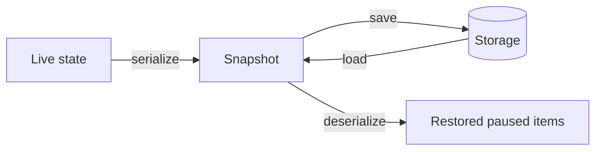

Persistence snapshots resumable upload state — intent plus cursor plus progress — so a user can
refresh the page (or survive a tab crash) and pick up where they left off. Only in-flight,
resumable items are stored; terminal ones are not.

## Adapters

All adapters implement `UploadPersistence.Adapter` and are imported from
`@gentleduck/upload/core`:

```ts
import {
  LocalStorageAdapter,
  IndexedDBAdapter,
  MemoryAdapter,
  createMemoryAdapter,
} from '@gentleduck/upload/core'
```

| Adapter | Storage | Sync? | Best for |
| --- | --- | --- | --- |
| `IndexedDBAdapter` | IndexedDB | async | Production; large/many uploads |
| `LocalStorageAdapter` | `localStorage` | sync | Small apps, few uploads (~5 MB cap) |
| `MemoryAdapter` | in-memory `Map` | sync | Tests, SSR |

`MemoryAdapter` is a shared singleton; call `createMemoryAdapter()` for an isolated store per
engine (important for multi-tenant setups).

The adapter interface is intentionally tiny:

```ts
type Adapter = {
  load(key: string): unknown | null | Promise<unknown | null>
  save(key: string, snapshot: unknown): void | Promise<void>
  clear(key: string): void | Promise<void>
}
```

## Enabling persistence

Pass `persistence` in `UploadPersistence.Options`. The default deserializer needs the `isPurpose`
and `isIntent` guards so it can safely validate untrusted stored data:

```ts
import { IndexedDBAdapter } from '@gentleduck/upload/core'

const store = createUploadStore<Intents, Cursors, Purpose, Result>({
  api,
  strategies,
  persistence: {
    key: 'uploads',
    version: 1,
    adapter: IndexedDBAdapter,
    debounceMs: 200,
    isPurpose: (v): v is Purpose => v === 'avatar' || v === 'document',
    isIntent: (v): v is Intents[keyof Intents] =>
      typeof v === 'object' && v !== null && 'strategy' in v && 'fileId' in v,
  },
})
```

| Option | Required | Description |
| --- | --- | --- |
| `key` | Yes | Storage key for the snapshot |
| `version` | Yes | Schema version; bump when intent/cursor shapes change |
| `adapter` | Yes | The `UploadPersistence.Adapter` to use |
| `debounceMs` | No | Delay before writing (batches progress bursts) |
| `isPurpose` / `isIntent` | With default deserializer | Runtime guards for untrusted data |
| `serialize` / `deserialize` | No | Custom mappers (skip the guards if you own both) |

## What gets stored

The built-in serializer keeps only items that have an intent and are in a non-terminal phase.
`completed`, `canceled`, and `error` items are excluded — persistence is for resuming, not
history. For each item it stores the fingerprint, the intent, the cursor, and last-known
progress. It never stores the browser `File` (see below).



## Restore behavior

On construction the store loads the snapshot and hydrates state. Restored items come back in the
`paused` phase with `file: undefined` — browser `File` objects can't be serialized. Progress and
cursor are restored when present. Each item is only restored if `isPurpose`/`isIntent` pass, the
intent's `strategy` is registered, and the cursor's strategy matches. Anything that fails a check
is silently skipped, which keeps old snapshots from a previous app version safe.

## Rebinding files

Because `file` is missing after restore, the user must re-select it before resuming. The
`rebind` command computes the new file's fingerprint and compares it against the stored one — the
match checks `name`, `size`, and `lastModified` (not `type`). On a match it attaches the file; on
a mismatch it's a silent no-op (the item stays paused without a file).

```ts
store.dispatch({ type: 'rebind', localId, file: reselectedFile })
store.dispatch({ type: 'resume', localId })
```

`rebind` sets the file synchronously in the reducer, so to auto-resume, check the snapshot right
after dispatching — `resume` is a no-op if the file wasn't attached:

```ts
store.dispatch({ type: 'rebind', localId, file: reselectedFile })
if (store.getSnapshot().items.get(localId)?.file) {
  store.dispatch({ type: 'resume', localId })
}
```

## Clearing

To wipe persisted uploads, call the adapter's `clear` with your key:

```ts
await IndexedDBAdapter.clear('uploads')
```
