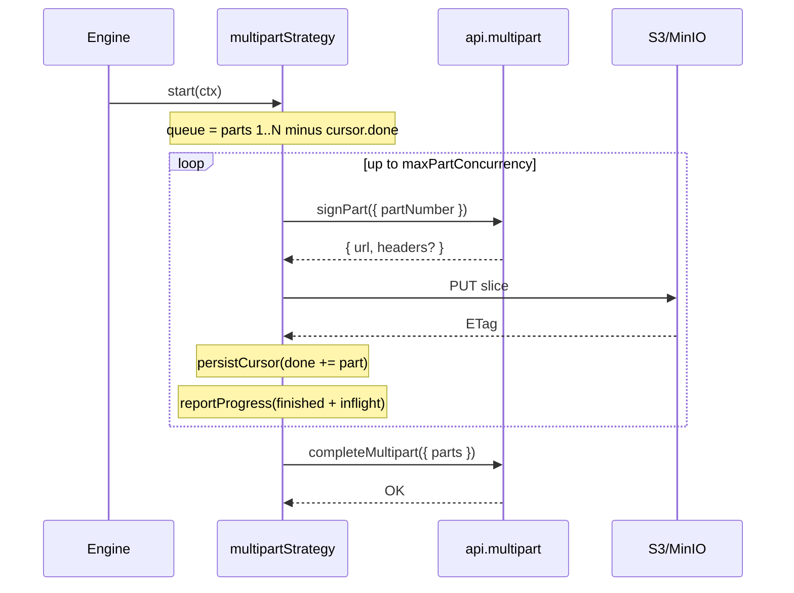

`multipartStrategy` slices a file into parts, signs each part on demand, PUTs them concurrently,
and finalizes with `completeMultipart`. It is resumable — completed part ETags are stored in the
cursor and skipped on resume.

```ts
import { multipartStrategy, MultipartStrategy } from '@gentleduck/upload/strategies'

strategies.set(multipartStrategy({ maxPartConcurrency: 4 }))
```

## Config

`MultipartStrategy.Config`:

| Option | Default | Description |
| --- | --- | --- |
| `maxPartConcurrency` | `4` | Max parts uploaded at once (clamped to ≥ 1) |
| `allowedHosts` | — | Case-insensitive host allow-list for signed part URLs |
| `allowPrivateHosts` | `false` | Allow private/loopback IPs in signed URLs |

Every signed part URL is validated before use: it must be `http`/`https`, must not contain `..`,
must match `allowedHosts` when set, and — unless `allowPrivateHosts` is true — must not point at
a private, loopback, link-local, or cloud-metadata address. If you leave `allowedHosts` unset,
the strategy warns once that signed URLs are host-unrestricted.

## Intent shape

Your `createIntent` returns `MultipartStrategy.Intent` for large files:

```ts
type Intent = {
  strategy: 'multipart'
  fileId: string
  uploadId: string          // S3/GCS multipart session id
  partSize: number          // bytes per part (S3 minimum is 5 MB, except the last)
  partCount: number         // total parts
  parts?: Array<{           // optional: all URLs pre-signed up front
    partNumber: number
    url: string
    headers?: Record<string, string>
  }>
}
```

## Cursor shape

`MultipartStrategy.Cursor` is what persists between runs:

```ts
type Cursor = {
  done: Array<{ partNumber: number; etag: string; size: number }>
  completed?: true // set after completeMultipart, so resume won't re-finalize
}
```

In the cursor **map** you register the raw cursor type; the engine wraps it as
`{ strategy: 'multipart', value }` when it surfaces through events and persistence:

```ts
type Cursors = { multipart?: MultipartStrategy.Cursor }
```

## Required backend methods

The strategy calls two methods on `api.multipart`:

```ts
const api: Contracts.Api.Me<Intents, Purpose, Result> = {
  createIntent, complete,
  multipart: {
    async signPart({ fileId, uploadId, partNumber, attempt }, ctx) {
      const res = await fetch('/api/uploads/sign-part', {
        method: 'POST',
        body: JSON.stringify({ fileId, uploadId, partNumber }),
        signal: ctx.signal,
      })
      return res.json() // { url: string; headers?: Record<string, string> }
    },
    async completeMultipart({ fileId, uploadId, parts }, ctx) {
      await fetch('/api/uploads/complete-multipart', {
        method: 'POST',
        body: JSON.stringify({ fileId, uploadId, parts }), // parts: { partNumber, etag }[]
        signal: ctx.signal,
      })
    },
    // Optional: listParts, abort
  },
}
```

If `intent.parts` is present, the strategy uses those URLs directly and skips `signPart` (the
legacy pre-sign mode). On-demand signing is preferred: URLs stay fresh and only the parts you
actually need get signed.

## How it runs



1. **Build the queue** from `partCount`, skipping parts already in the cursor.
2. **Upload concurrently**, up to `maxPartConcurrency`, signing each part on demand.
3. **Collect ETags.** Each PUT must return an `ETag`; expose it via CORS
   (`Access-Control-Expose-Headers: ETag`) or the strategy throws.
4. **Persist the cursor** after every completed part.
5. **Finalize** with `completeMultipart`, then mark the cursor `completed: true`.
6. **Retry transient part failures** (network/timeout/5xx) up to 3 times with exponential
   backoff (500 ms, 1 s, 2 s) before failing the item.

Progress is `finishedBytes + inflightBytes` over the total, so it stays smooth even with parts
in flight.

## Pause & resume

`resumable` is `true`. Pausing aborts in-flight PUTs; the cursor already holds every completed
part. On resume the strategy reads the cursor, skips done parts, and continues. If the cursor is
marked `completed`, it skips `completeMultipart` too — no double assembly.

## When to use

- Files larger than the POST strategy's practical limit.
- Unreliable connections where losing one part beats losing the whole file.
- High-bandwidth links where concurrent parts improve throughput.
