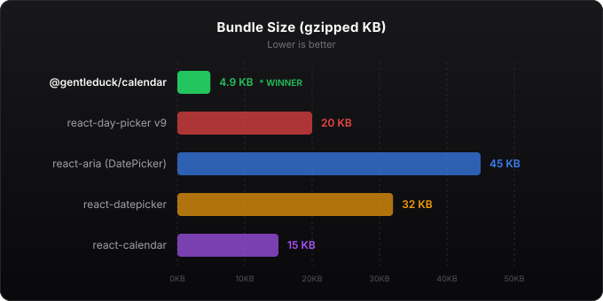
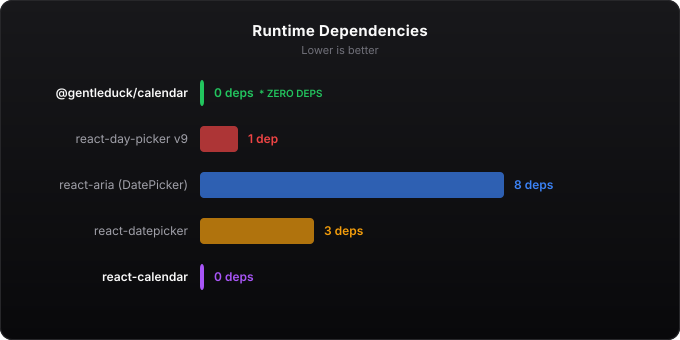
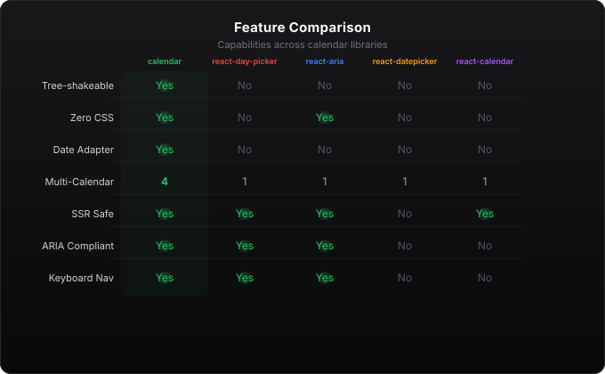
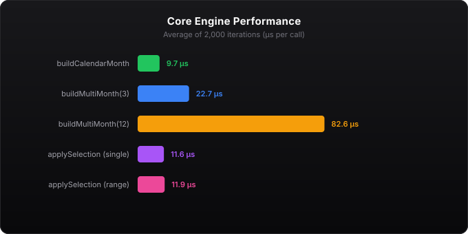

# @gentleduck/calendar

Headless, framework-agnostic calendar engine with date adapter pattern, React hooks, and compound components.

**65% smaller than react-day-picker** — 7.0 KB gzipped vs ~20 KB. Zero dependencies. Full keyboard navigation and ARIA compliance.

## Benchmarks

### Bundle Size — vs All Competitors



### Dependencies



### Feature Comparison



### Render Performance



Run benchmarks locally:

```bash
bun run benchmark
```

## Quick Start

```tsx
import { NativeAdapter, useCalendar } from '@gentleduck/calendar'

const adapter = new NativeAdapter()

function MyCalendar() {
  const { state, getDayProps, getGridProps } = useCalendar({
    adapter,
    mode: 'single',
  })

  return (
    <div {...getGridProps()}>
      {state.weeks.map(week =>
        week.days.map(day => (
          <button key={day.date.getTime()} {...getDayProps(day)}>
            {day.date.getDate()}
          </button>
        ))
      )}
    </div>
  )
}
```

## Features

- **Date Adapter Pattern** — Plug in any date library (native Date, dayjs, date-fns, Temporal)
- **Selection Modes** — Single, range, multi-select with type-safe conditional types
- **Multi-Month** — Display 1–12 months side by side
- **Time Picker** — useTimePicker hook with spinbutton ARIA
- **DateTime Picker** — useDateTime composing calendar + time
- **Keyboard Navigation** — Arrow keys, Page Up/Down, Home/End, Enter/Space, Escape
- **Screen Reader** — aria-live announcements for navigation and selection
- **Roving TabIndex** — Proper focus management with DOM focus sync
- **Zero CSS** — Style with data-* attributes using Tailwind, CSS modules, or vanilla CSS
- **Tree-Shakeable** — `sideEffects: false`, import only what you use

## Architecture

```
@gentleduck/calendar
├── adapter/     — DateAdapter<TDate> interface + NativeAdapter
├── grid/        — buildCalendarMonth, buildMultiMonth, year/decade views
├── selection/   — selectDay, applySelection, range/multi logic
├── navigation/  — navigate, canNavigate, month/year jumping
├── time/        — TimeValue, clampTime, incrementField, formatters
└── react/       — useCalendar, useTimePicker, useDateTime, useKeyboard, useAnnouncer
```

## Documentation

Full docs at [gentleduck.dev/docs/packages/duck-calendar](https://gentleduck.dev/docs/packages/duck-calendar)

## License

MIT
