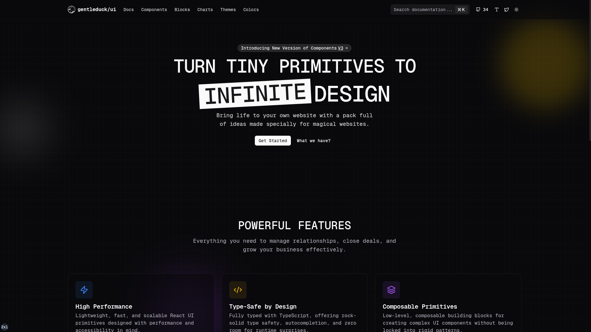

<p align="center">
  
</p>

# @acme/docs

Next.js documentation site for acme/ui. Covers components, blocks, charts, themes, and registry-powered previews.

## Stack
- Next.js App Router
- `@gentleduck/docs` (shared docs kit)
- Velite (MDX pipeline)
- Registry tooling for component previews

## Quick Start
```bash
bun --filter @acme/docs dev:docs
bun --filter @acme/docs dev
```

## Scripts
- `bun --filter @acme/docs dev` – run the dev server
- `bun --filter @acme/docs build` – production build
- `bun --filter @acme/docs start` – serve the build
- `bun --filter @acme/docs dev:docs` – watch/generate MDX content
- `bun --filter @acme/docs build:docs` – one-time MDX build
- `bun --filter @acme/docs build:reg` – rebuild the UI registry and format output
- `bun --filter @acme/docs lint` – lint

## Environment
- `.env` is optional; see `.env.example` for defaults.
- Registry build inputs and output paths live in `registry-build.config.ts`, not in `.env`.
